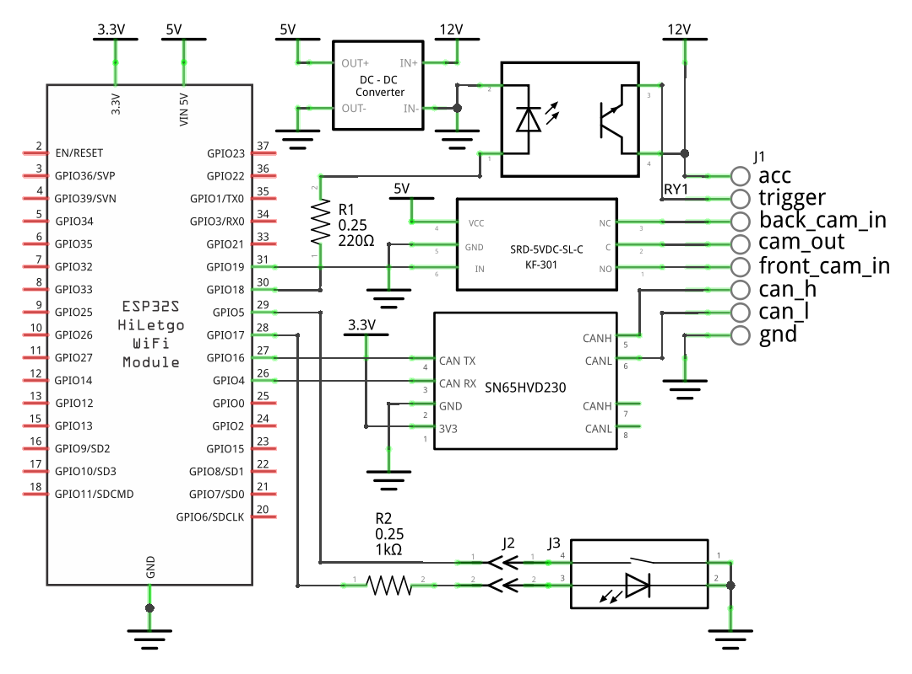
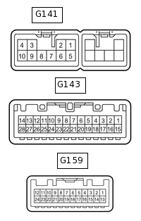
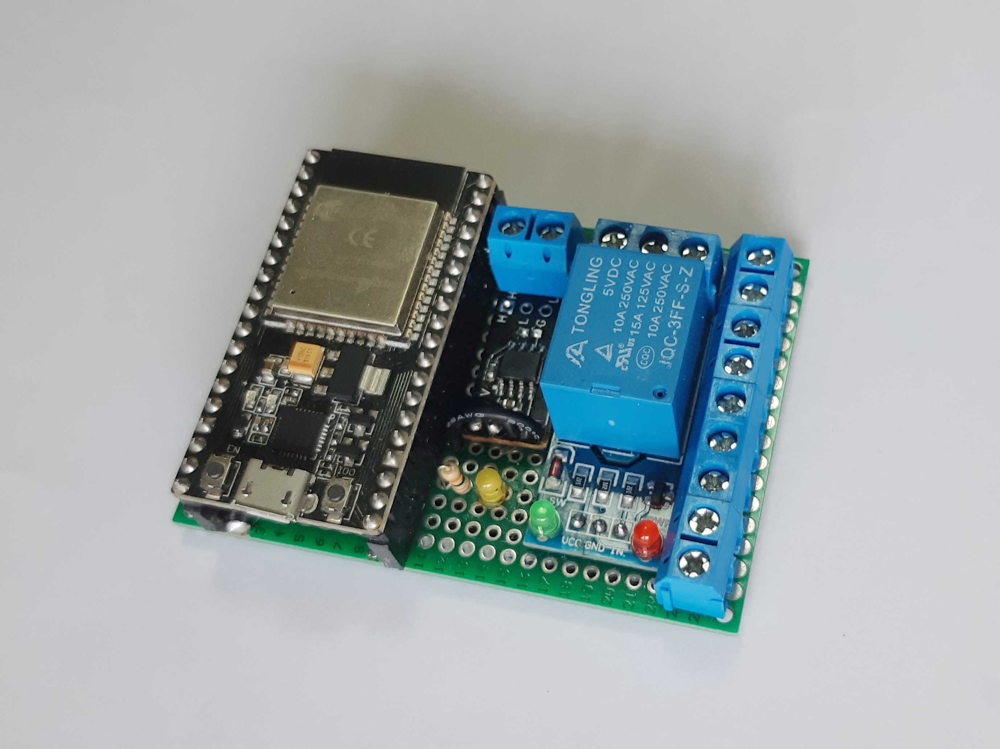

# Toyota CamBridge
[Русский](README.ru.md)

## What It Is
A device that allows you to connect a **front camera** to your stock toyota head unit — if a rear one is already installed.  
Tested on the 4th generation RAV4, but will likely work with other models as well.

## How It Works
CamBridge connects to the **CAN bus** and reads data from:
- the gear selector,
- vehicle speed,
- parking sensors.

Based on this data, the device decides when and which camera to activate.

## Operating Logic
**Auto mode** (default):
- When in **R**, the rear camera turns on.
- When in **D**, the front camera turns on if:
    - gear **D** has been engaged less than 2 seconds ago;
    - speed < 10 km/h and the car is moving or stopped for less than 2 seconds;
    - the parking sensor detects an obstacle in front.

**Button (optional):**  
Allows manual switching between modes.
- When in **R** — you can view the front camera.
- When in **D** — you can force the front camera on or disable it entirely.

The LED on the button indicates when one of the alternative modes is active.

## How to Build It

### Circuit

### Device Pins
| Pin          | Description                                                             |
|--------------|-------------------------------------------------------------------------|
| acc          | Power input, can be taken from the head unit (ACC)                      |
| trigger      | Video activation signal, connect to the HU instead of the reverse input |
| back_cam_in  | Video input from the rear camera                                        |
| cam_out      | Video output, connect to the HU instead of the rear camera input (V+)   |
| front_cam_in | Video input from the front camera                                       |
| can_h        | CAN bus high                                                            |
| can_l        | CAN bus low                                                             |
| gnd          | Ground                                                                  |

### Head Unit Connection (RAV4 IV)

| Signal | Pin     | Color  | Description                                                             |
|--------|---------|--------|-------------------------------------------------------------------------|
| ACC1   | G141-3  | Gray   | +12V when ignition is ON                                                |
| GND1   | G141-7  | Brown  | Power ground                                                            |
| REV    | G143-2  | Green  | Camera activation input, normally connected to the reverse light signal |
| CANH   | G143-9  | Yellow | CAN bus high                                                            |
| CANL   | G143-10 | White  | CAN bus low                                                             |
| V+     | G159-12 | White  | Analog composite video (NTSC)                                           |
| V-     | G159-24 | Red    | Video signal ground*                                                    |

\* To reduce noise, connect the front camera video ground only to "V-".

Other models may have different connectors.

## Device Appearance

## Firmware
1. Install [ESP32 support](https://docs.espressif.com/projects/arduino-esp32/en/latest/installing.html) in Arduino IDE.
2. Select the **NodeMCU-32S** board.
3. Upload the [sketch](toyota-cambridge.ino).

## Tips
- Female “Dupont” jumpers fit directly into the HU connectors, allowing installation without soldering.
- To remove a pin from a HU connector, [lift the lock tab](images/conn-unlock.jpg) by 2 mm and [release the latch](images/conn-pins.jpg) with a needle.
- If the front camera image flickers, it’s likely due to overheating — reducing voltage to 9 V helped in my case.
- For extra reliability, feed the reverse signal through a diode — the rear camera will still activate even if the device fails.

## Components
| Component       | Notes                                                                    | ~$       |
|-----------------|--------------------------------------------------------------------------|----------|
| Camera          | Available on AliExpress, often with OEM-style bumper mounts              | 25       |
| ESP-32S         | Any ESP32-based module should work                                       | 3        |
| SN65HVD230      | TWAI CAN transceiver (3.3 V)                                             | 2        |
| HW-307          | 5 V relay module                                                         | 1        |
| Mini-360        | DC-DC converter to 5 V                                                   | 0.5      |
| PC817           | Optocoupler                                                              | 0.5      |
| Resistors       | 220 Ω, 1 kΩ                                                              | 0.1      |
| KF301           | Terminal blocks, at least 5 pcs; also good for signal ground connections | 0.5      |
| Prototype board | Fits [nicely](images/in-place.jpg) on a 50×70 mm board                   | 1        |
| Button          | OEM-style illuminated non-fixed button with indicator (AliExpress)       | 5        |
| **Total**       |                                                                          | **~$40** |
