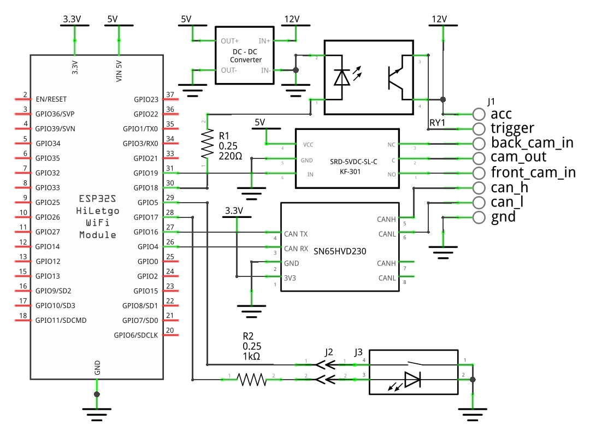
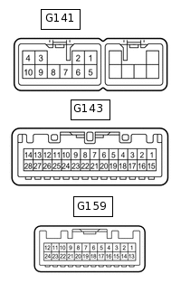

# Toyota CamBridge
[English](README.md)

## Что это
Устройство, которое позволяет подключить **переднюю камеру** к штатной магнитоле toyota — если уже есть задняя.  
Проверено на RAV4 IV поколения, но скорее всего подойдёт и для других моделей.

## Как работает
CamBridge подключается к **CAN-шине** и считывает данные о:
- положении селектора КПП,
- скорости,
- сигналах парктроников.

На основе этого устройство выбирает, когда и какую камеру включить.

## Логика работы
Режим "авто" (по умолчанию):
- При **R** включается задняя камера.
- При **D** — передняя, если:
	- передача **D** включена менее 2 секунд назад;
	- скорость < 10 км/ч и авто едет или остановилось менее 2 секунд назад;
	- парктроник видит препятствие спереди.

**Кнопка (опционально):**  
Позволяет вручную переключать режимы.
- При **R** — можно посмотреть переднюю камеру.
- При **D** — включить переднюю камеру постоянно или отключить совсем.

Светодиод на кнопке говорит о включении одного из альтернативных режимов.

## Как это собрать

### Схема

### Выводы устройства
| Вывод        | Описание                                                            |
|--------------|---------------------------------------------------------------------|
| acc          | Питание, можно взять от магнитолы (ACC)                             |
| trigger      | Активация видео, подключить в ШГУ вместо сигнала заднего хода (REV) |
| back_cam_in  | Вход видео от задней камеры                                         |
| cam_out      | Выход видео, подключить в ШГУ вместо задней камеры (V+)             |
| front_cam_in | Вход видео от передней камеры                                       |
| can_h        | Шина CAN H                                                          |
| can_l        | Шина CAN L                                                          |
| gnd          | Масса                                                               |

### Подключение к ШГУ (RAV4 IV)

| Вывод | Пин     | Цвет       | Описание                                                                      |
|-------|---------|------------|-------------------------------------------------------------------------------|
| ACC1  | G141-3  | Серый      | +12В при включённом зажигании                                                 |
| GND1  | G141-7  | Коричневый | Масса питания                                                                 |
| REV   | G143-2  | Зеленый    | Вход активации картинки с камеры, штатно подключен сигнал заднего хода, 0/12в |
| CANH  | G143-9  | Желтый     | Шина CAN H                                                                    |
| CANL  | G143-10 | Белый      | Шина CAN L                                                                    |
| V+    | G159-12 | Белый      | Аналоговое композитное видео, NTSC                                            |
| V-    | G159-24 | Красный    | Масса видеосигнала*                                                           |

\* Для уменьшения шумов массу видеосигнала передней камеры подключить только к "V-".

На других моделях могут быть другие разъемы

## Вид устройства

## Прошивка
1. Установите [поддержку ESP32](https://docs.espressif.com/projects/arduino-esp32/en/latest/installing.html) в Arduino IDE.
2. Выберите плату NodeMCU-32S
3. Залейте [скетч](toyota-cambridge.ino).

## Полезное
- Разъемы "мама" на провод "dupont" подходят на место пинов в раземах в ШГУ. Это позволяет установить устройство в машину без пайки.
- Чтобы вытащить пин из разъема ШГУ нужно [приподнять фиксатор](images/conn-unlock.jpg) на 2мм и [подцепить язычок](images/conn-pins.jpg) иголкой.
- Если картинка передней камеры моргает, вероятно дело в ее перегреве. Мне помог даунвольт до 9в.
- Для надёжности можно подать сигнал заднего хода через диод — задняя камера включится даже при сбое устройства.

## Компоненты
| Компонент  | Примечание                                                                | ~$       |
|------------|---------------------------------------------------------------------------|----------|
| Камера     | На алиэкспрессе есть с креплением на свой бампер                          | 25       |
| ESP-32S    | Скорее всего подойдет любой аналог на esp32                               | 3        |
| SN65HVD230 | TWAI CAN трансивер (3.3В)                                                 | 2        |
| HW-307     | Модуль реле 5В                                                            | 1        |
| Mini-360   | DC-DC на 5В                                                               | 0.5      |
| PC817      | Оптопара                                                                  | 0.5      |
| Резисторы  | 220Ω, 1KΩ                                                                 | 0.1      |
| KF301      | Клеммы, минимум 5 шт. Ими также можно соединять сигнальные земли          | 0.5      |
| Макетка    | У меня все плотненько [поместилось](images/in-place.jpg) на плате 50x70мм | 1        |
| Кнопка     | На алиэкспрессе есть штатные кнопки с подсветкой и индикатором            | 5        |
| **Итого**  |                                                                           | **~40$** |